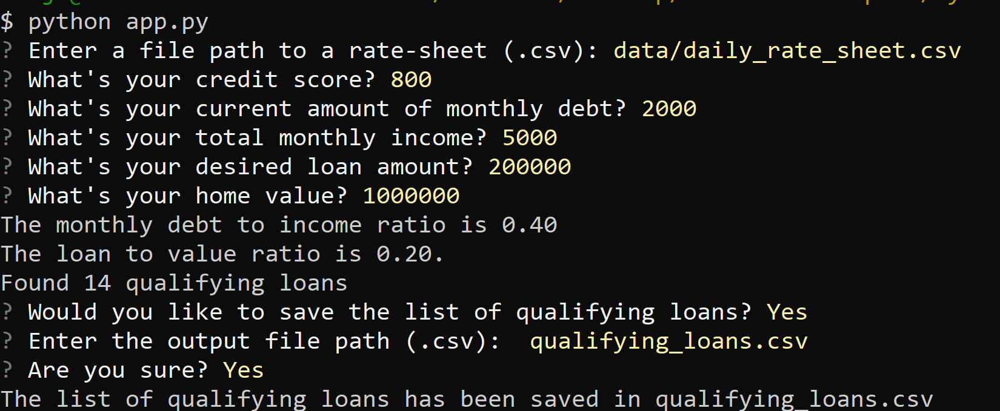

# Loan Qualifier Application

For this project, I wanted to create a python application that could interact with the user via Command-Line Interface (CLI) to determine which loans he/she qualified for in buying a home, based on his/her credit score, monthly debt, monthly income, desired loan amount, and value of desired property. The CLI allows them to input their specific information, generate a list of qualifying loans, and save the list in a csv file at the location of their choice.

---

## Technologies

This project used **Python 3.9** and was created on a **Windows 10** operating system. It also imported the following libraries: **sys**, **fire**, **questionary**, **csv**, **os.path**. It also imported these specific tools: *confirm* from **click**, *Path* from **pathlib**, and *path* from **os**. It also made used of **modular** programming following the principles of DRY (Don't Repeat Yourself) by creating important functions in separate python files, and importing them from their respective files when needed in the main app.py file.

---

## Installation Guide

The only separate packages necessary to be installed on top of **Python 3.9** is **Python Fire** and **Questionary**. 

Run the following code in Gitbash or the Terminal environment to install Python Fire:

>"pip install fire"

Run the following in Bash or Terminal to install Questionary:

>"pip install questionary"

---

## Usage

Navigate on your preferred terminal application to the directory containing this app. Type:

>"python app.py"

The CLI will ask you to enter a file path to a rate-sheet (.csv). You can navigate to the existing rate-sheet by typing: 
>"data/daily_rate_sheet.csv"

The CLI will then ask for your credit score, monthly debt, monthly income, desired loan amount, and value of desired property. After entering in the relevant information, it will print your loan to value ratio, and the number of loans that fit your credit profile. It will then ask you if you would like to save the list of qualifying loans. Type "y" to save this list for later use. 

The CLI will then ask for an output file path (.csv). Enter a location like before, except this will be the place where your custom list of loans will be saved. If no preference, simply type:
>"qualifying_loans.csv"

This will create a csv file of your qualifying loans in the directory next to the main app.py file. Confirm "y" and your csv file will be waiting in your directory.

Here is an example of what you will see:

This project comes included with the example list of qualifying loans, **example_qualifying_loans.csv**

---

## Contributors

Heeje Yoo - 
`heeje.yoo@pm.me`

---

## License

MIT License
